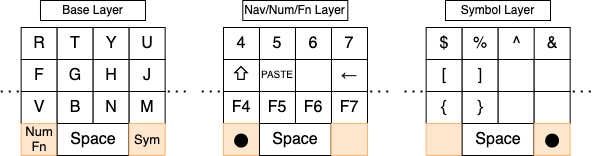
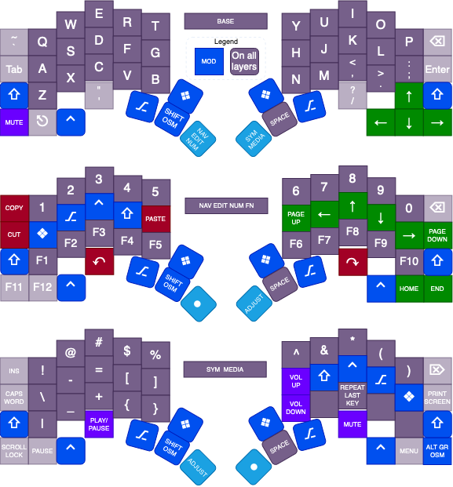

People have different reasons for using 40% keyboards, yet common ones are:

- Small boards are easy to carry and fit on small surfaces.
- Small is cool, cute or elegant, based on taste.
- Good layers move many keys 'close', making larger boards less useful.

Small things fitting in more places is obvious and includes backpacks and small desks.
Many also prefer mechanical keys over rubberized chiclet keys;
  using fewer of the (bulkier) mechanical keys helps with portability.

Tailoring for just the needs at hand is elegant. 
If you normally type just letters, carrying around keys for the numbers and symbols is just silly. 
Showing individuality is also a need, and smaller boards are easier to customize than larger ones.
Some people like smaller keyboards with cool keycaps, cases and sound.

Effective layering can make small boards more efficient 
  than large unlayered boards, once learned.
Layers let keys do multiple jobs based on what other keys are also pressed, 
  just like the normal shift and other modifier keys do.
Using 'shifted' layers for more than just capital letters means more tasks can be done efficiently 
  with just the keys next to the fingers, including writing programs or novels.
Using a large unlayered board means reaching further for things 
  that layers can put right under our hand.

# Why use a layered 40% keyboard?

Just under half of the keys on a laptop keyboard require that the hands be moved or stretched 
  to hit small distant targets and then reoriented back to the home row. 
That reaching and reorienting is slow and can lead to hand issues.

Forty-percent keyboards reduce finger and hand stretching by moving less frequent keys 
  onto added layers right under the fingers. 
Full-size keyboards already do this by using the shift key 
  for capital letters and most of the symbols. 
We don't have huge keyboards with separate capital letter keys and far more symbol keys. 
Forty-percent keyboards apply the same idea to a smaller set of base keys, 
  often just the core letter area plus side columns, and often use just four rows.

A simple 40% keymap has two new layers and two new layer-shift keys. 
Holding one layer key provides navigation, editing, numbers and functions; 
  holding the other provides symbols.

Pressing a combination of easy-to-reach keys can be faster and easier 
  than reaching for a distant key. 
Access can be by pressing the layer-shift and base keys together, 
  in sequence, or with other options. 
The user can customize which characters, strings or functions are 
  on the base layer and how they access those on other layers. 
Common choices include a number pad, 
  richer navigation and editing on a dedicated layer, 
  or a leader key that outputs text snippets from short prefixes.

Once effective layering is used, 
  similar full-size keyboards are unneeded bulk and expense.

Preferred board sizes vary, but four rows and 12 to 13 keys wide (12u-13u) is common. 
This is an easier size to start with, and many people find no reason to go smaller later. 
This size keeps the letters and outer columns (delete, shift and return) as the base layer,
  with a bottom row of central thumb keys for space, layers and modifiers, 
  and possible side utility keys for arrows or extras. 
It means the fingers never need to move far and allows a simple layering scheme. 
Smaller ten-key wide boards offer even less finger reach and size, 
  but require more complex layering methods.  

Preferences also vary on the physical key arrangement: 
  between row stagger, ortho-linear, or ergo/column stagger
  and between unibody or split case bodies.
Some are more familiar, 
  while others are more common in high-end ergonomic boards.

Many small keyboard users are programmers. 
We are often typing or editing and care about efficiency and hand ergonomics. 
There are times when a function or number row is very handy, 
such as for games or graphical tools that have heavy function and modifier use. 
But for general typing, including programming, moving the keys to the fingers 
  instead of the fingers to the keys has advantages.

## Example keymap

As an example, the Hillside's default keymap has the core parts of familiar side columns, 
  base layer arrow keys, 
  and two central thumb keys that give easy access to two additional layers.
On those layers, numbers and symbols have familiar locations,
  function keys line the bottom row, and navigation 
  and editing keys are the home row of the nav/edit layer. 
The keymap was designed with familiar elements for easier initial use 
  but also with more efficient layer-based alternatives that can be grown into. 

The [KeymapDB](https://keymapdb.com/) has examples for different sizes, shapes, preferences and needs.

## Keyboard trade-offs

Small keyboards are a collection of choices and trade-offs:

- Smaller is more compact with less finger and hand travel, 
  but extremely small has more complex or longer layer activation methods. 
- When creating a unique personalized board,
  fewer keys means smaller and needing fewer parts.
- Physical key arrangement could be row stagger, othro-linear or ergo/column stagger, 
  and the case could be unibody or split.
- Various case, switch and keycap materials, colors and designs are possible.
- Layers can be activated with different methods: keys nearby, keys farther away,
  key holds, one shot keys, chords, or timing or repeat based.
- What goes on each layer.
- Layout within each layer: what goes on the thumbs, 
  the home, top and bottom rows, and the sides.
